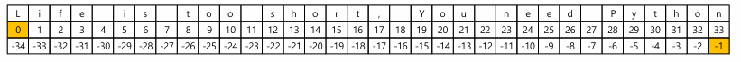

1. 사칙 연산자의 / 연산자의 몫 연산자 // 차이는?

2. 문자열 슬라이싱에서 `0`은 문자열의 첫 번째 문자, `-1`은 문자열의 맨 마지막 문자를 의미한다.
   

3. 파이썬이 기존 언어와 다른 연산자를 채택하고 있는데, 그걸 아는 것이 중요

   1. c언어에선 //는 주석인데 python에선 연산자로 쓰임!
   2. c언어엔 있는데 python엔 없는 것: 지수 연산자 print(a\*\*b), 몫 연산자: print(a//b)

4. 리스트 안에는 어떠한 자료형도 포함할 수 있다.

5. find와 index는 에러 처리에 차이가 있다.
   1. find는 에러발생 x, index는 에러 발생 o
6. reverse는 정렬과 무관

7. remove는 여러 개 있으면 첫 번째 제거

8. `",".join(abcd)` => `a,b,c,d`

9. 리스트 관련 함수 함수의 인자는 리스트만 가능

10. 튜플은 불변하기 때문에 item을 바꿀 수 없다. 리스트는 item 생성, 삭제, 수정 가능

11. 집합은 순서가 없지만 리스트, 튜플은 순서가 있다.

---

<br>

# 06\_문자열 관련 함수 문제

## 문제 1

문자열에서 문자 'a'의 개수를 세는 코드를 작성하세요.

## 문제2

문자열 a = "programming"에서 문자 'm'이 처음으로 나타나는 위치를 찾는 코드를 작성하세요.

## 문제3

문자열 "apple"에서 find()와 index()의 차이를 확인해보세요. 문자 'p'와 'z'를 찾는 코드를 작성하세요.

## 문제4

문자열 "abcd"를 콤마(,)로 구분하여 연결된 문자열로 변환하는 코드를 작성하세요.

## 문제5

문자열 "HELLO world"를 모두 소문자로 변환한 결과를 출력하는 코드를 작성하세요.

## 문제6

다음 문자열에서 왼쪽과 오른쪽의 공백을 제거한 후 결과를 출력하세요.

## 문제7

문자열 "I love apples"에서 "apples"를 "bananas"로 변경하는 코드를 작성하세요.

## 문제8

문자열 "one:two:three:four"를 콜론(:)을 기준으로 분리한 후, 결과를 출력하세요.

## 문제9

다음 문자열에서 모든 공백을 제거하고, 그 결과를 출력하세요.

<br>

# 07_bool

## 문제1

다음 코드의 출력 결과를 예측해보세요.

```python
a = bool("Hello World")
b = bool("")
c = bool([0, 1, 2])
d = bool([])

print(a)
print(b)
print(c)
print(d)
```

## 문제2

다음 코드에서 참(True) 또는 거짓(False)으로 평가되는 값을 확인하고, 올바른 결과를 예측하세요.

```python
a = bool(0)
b = bool(-1)
c = bool(3.14)
d = bool(None)

print(a)
print(b)
print(c)
print(d)
```

## 문제3

다음 리스트에서 참(True)로 평가되는 값만 출력하도록 코드를 작성하세요.

```python
items = [0, 1, "", "Python", [], [1, 2], {}, {"key": "value"}, None]

# 힌트: for 문과 if 문을 활용하세요.
```

## 문제4

사용자로부터 입력받은 값이 비어있지 않으면 "입력되었습니다"를 출력하고, 비어 있으면 "입력되지 않았습니다"를 출력하는 프로그램을 작성하세요.

```python
# 예시
user_input = input("값을 입력하세요: ")

# 여기서 작성
```

## 문제5

다음 값들이 참(True)인지 거짓(False)인지 확인하는 코드를 작성하세요.

```python
bool("False")
bool([])
bool([None])
bool({})
bool(100)
```

<br>

# 08_variable

## 문제1

다음 코드의 출력 결과를 예측해보세요.

```python
a = [1, 2, 3]
b = a

a[0] = 100
print(a)  # ?
print(b)  # ?
```

## 문제2

다음 코드에서 a와 b가 같은 객체를 가리키는지 확인하는 코드를 작성하세요.

```python
a = [1, 2, 3]
b = a[:]

# a와 b가 같은 객체인지 확인하는 코드
```

## 문제3

copy 모듈을 사용하지 않고 리스트 a를 복사하여 b에 저장한 후, a의 값을 수정했을 때 b의 값이 영향을 받지 않도록 하세요.

```python
a=[1,2,3]

# 여기서 작성
```

## 문제4

다음 코드를 실행했을 때 출력 결과가 무엇일지 예측하세요.

```python
a, b = ("apple", "banana")
print(a)  # ?
print(b)  # ?
```

## 문제5

다음 코드에서 여러 변수에 같은 값을 할당하고, 그 값을 출력하는 코드를 작성하세요.

```python
a = b = c = "hello"

print(a)  # ?
print(b)  # ?
print(c)  # ?
```

## 문제6

두 변수 a와 b의 값을 서로 바꾸는 코드를 작성하세요.

```python
a = 10
b = 20

# a와 b의 값을 바꾸는 코드
print(a)  # 20
print(b)  # 10
```

## 문제7

리스트 [10, 20, 30]을 변수 a, b, c에 각각 할당하는 코드를 작성하세요. 한 줄로 해결해 보세요.

```python
# 예시: a = 10, b = 20, c = 30
```
